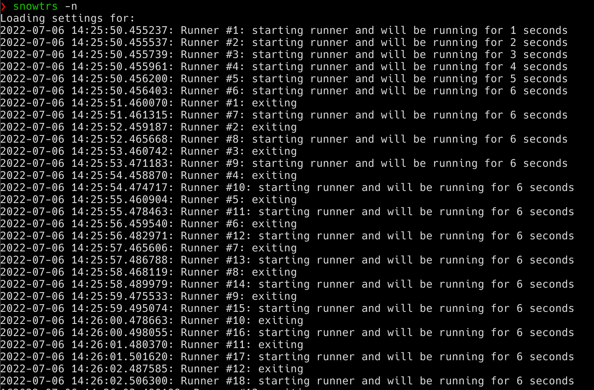

# Trigger ATF Test / Suite from another instance

- [Trigger ATF Test / Suite from another instance](#trigger-atf-test--suite-from-another-instance)
  - [What does `servicenow-test-runner-scheduler` do?](#what-does-servicenow-test-runner-scheduler-do)
  - [Installation](#installation)
    - [pipx](#pipx)
    - [pip](#pip)
  - [Configure](#configure)
  - [Usage](#usage)
  - [Demo](#demo)


## What does `servicenow-test-runner-scheduler` do?
- Start `NUM_INSTANCE` (default: 6) instances of the client test runner concurrently
- After `RESTART_INTERVAL // NUM_INSTANCE` (default: `7200 // 6 = 1200`) seconds, the first runner will be restarted, and after another 1200 seconds, the seconds runner will be restarted, and so on.
- After all the runner have been restarted once, all the 6 runners will be scheduled to restarted every `RESTART_INTERVAL` (default: `7200`) seconds.


## Installation

Install `python3` and [`chromedriver`](https://sites.google.com/chromium.org/driver/) first.  

### pipx

This is the recommended installation method.

```
$ pipx install servicenow-test-runner-scheduler
```

### [pip](https://pypi.org/project/servicenow-test-runner-scheduler/)

```
$ pip install servicenow-test-runner-scheduler
```


## Configure

- Create a `.env` file and put it in the same directory as the `trigger_test_zipapp.pyz` file.
- Edit the `.env` files, so it looks like this:

    ```ini
    # required fields
    instance=https://dev105825.service-now.com
    userid=admin
    password=admin_pw

    # optional fields, the value shown here are the default values
    RESTART_INTERVAL=7200
    TOLERANCE=300
    NUM_INSTANCE=6
    CHECKING_INTERVAL=300
    ```

## Usage

```
$ snowtrs --help # or servicenow-test-runner-scheduler --help

Loading settings for: 
usage: servicenow-test-runner-scheduler [-h] [-V] [-n] [-s]

ServiceNow - Start ATF test runner in browser

options:
  -h, --help            show this help message and exit
  -V, --version         show program's version number and exit
  -n, --dry-run         Dry run (default: False)
  -s, --scheduled-runner
                        Start a scheduled runner (default: Client test runner) (default: False)
```


## Demo


Configuration of this demo:

```ini
# .env
RESTART_INTERVAL=6
TOLERANCE=1
NUM_INSTANCE=6
CHECKING_INTERVAL=1
```

Run `servicenow-test-runner-scheduler --dryrun`.


